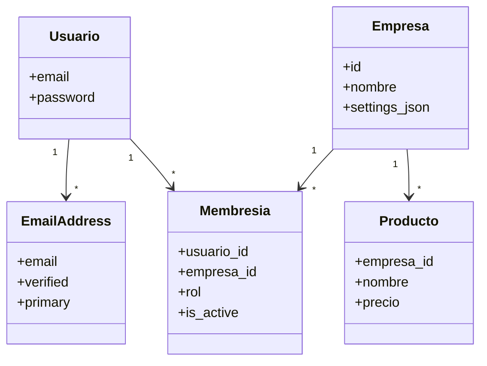

## Critical Rule: Always Review Documentation

# Documento de Arquitectura de Software

## Sistema SaaS Multi-Empresa (Estilo Odoo)

**Versión:** 1.3  
**Fecha:** 05 de Enero, 2026  
**Stack:**

| Componente     | Tecnología                |
| -------------- | ------------------------- |
| Backend        | Django 6.0 (Python 3.13)  |
| Templates      | Django Templates          |
| Interactividad | HTMX 2.0                  |
| Estado UI      | Alpine.js 3.x             |
| Estilos        | TailwindCSS + DaisyUI 4.x |
| Base de Datos  | PostgreSQL 16 (Docker)    |
| Auth           | django-allauth            |
| Multi-tenant   | django-multitenant        |
| Permisos       | django-rules              |

**Patrón de Arquitectura:** Shared Database / Shared Schema (Row-Level Multi-tenancy)

---

## 1. Visión General del Sistema

El objetivo es desarrollar una plataforma SaaS B2B de uso **interno**, donde la identidad del usuario es única y global, pero su acceso a los datos está segmentado por "Empresas" (Tenants).

Un usuario puede pertenecer a múltiples empresas con distintos roles y cambiar de contexto (Hot-Switching) sin cambiar de dominio, replicando la experiencia de usuario de Odoo ERP.

La simplicidad operativa es un principio rector: se evita complejidad innecesaria (por ejemplo, autenticación social o microservicios no justificados).

---

## 2. Estrategia de Tenancy (Inquilinos)

### 2.1 Modelo: Base de Datos Compartida, Esquema Compartido

Todos los inquilinos (empresas) conviven en las mismas tablas de PostgreSQL.

- **Mecanismo de Aislamiento:** Inyección automática de filtros SQL (`WHERE empresa_id = X`) en tiempo de ejecución.
- **Gestión de Identidad:** Centralizada y Global (un usuario existe una sola vez en el sistema).
- **Cambio de Contexto:** Controlado por sesión, no por subdominios ni schemas.

---

## 3. Stack Tecnológico Crítico

### 3.1 Backend

| Capa              | Tecnología          | Función                                     | Alcance         |
| ----------------- | ------------------- | ------------------------------------------- | --------------- |
| Identidad / Auth  | django-allauth      | Registro, login, recuperación de contraseña | Global          |
| Backend Core      | Django              | Framework Web                               | Global          |
| Aislamiento Datos | django-multitenant  | Filtros automáticos por tenant en ORM       | Tenant-Specific |
| Permisos          | django-rules        | Autorización basada en reglas               | Tenant-Specific |
| Base de Datos     | PostgreSQL (Docker) | Persistencia                                | Compartida      |

---

### 3.2 Frontend (Decisión Arquitectónica Obligatoria)

El frontend se construye **sin SPA ni framework JS pesado**.

- **HTML Server-Side:** Django Templates
- **Interactividad:** HTMX
- **Estado ligero / UI helpers:** Alpine.js (solo cuando HTMX no sea suficiente)
- **Estilos:** TailwindCSS
- **Componentes UI:** DaisyUI (basado en Tailwind)

> ❗ **No se permite CSS plano ni frameworks alternativos (Bootstrap, MUI, etc.)**  
> ❗ **No se permite React, Vue, Angular o similares**

---

### 3.3 Infraestructura y Servicios

- **PostgreSQL:** Obligatoriamente en Docker
- **Redis / Celery / Mailhog / etc.:** Si se requieren, **también en Docker**
- **Regla General:**
  > _Cualquier servicio que deba instalarse debe ejecutarse vía Docker o Docker Compose._

---

## 4. Autenticación y Autorización

### 4.1 Estrategia de Autenticación

El sistema **NO permite autenticación con redes sociales**.

**Razones:**

- Software de uso interno
- Menor superficie de ataque
- Menor complejidad operativa
- Control total sobre credenciales

**Método único de autenticación:**

- Email + Password

---

### 4.2 Configuración de django-allauth

- Se utiliza **solo el módulo `account`**
- `socialaccount` **NO se instala**

---

## 5. Diseño del Modelo de Datos

La arquitectura de datos se divide en dos ámbitos estrictos:

- **Ámbito Global (Identity)**
- **Ámbito Tenant (Business Data)**

---

### 5.1 Ámbito Global (Sin tenant_id)

Estas tablas **NO** deben filtrarse por empresa.

1. Usuario (CustomUser)
2. Empresa (Tenant)
3. Membresia (Usuario <-> Empresa + Rol)
4. Tablas de allauth:
   - `account_emailaddress`

> ❗ **No existen tablas SocialAccount / SocialToken**

---

### 5.2 Ámbito Tenant (Con tenant_id)

Estas tablas contienen los datos del negocio y **SIEMPRE** se filtran.

- Producto
- Factura
- Cliente
- Inventario
- Etc.

Todos los modelos deben heredar de `TenantModel`.

---

## 6. Diagrama de Clases



---

## 7. Componentes de Arquitectura

### 7.1 Middleware de Contexto (TenantMiddleware)

Responsable de establecer el tenant activo en cada request autenticado.

**Responsabilidades:**

1. Leer `request.session['active_empresa_id']`
2. Validar membresía
3. Ejecutar `set_current_tenant(empresa)`
4. Inyectar `request.empresa` y `request.rol_actual`

---

### 7.2 Sistema de Permisos (django-rules)

- No se usan permisos en base de datos (`auth_permission`)
- Toda la lógica se define en código (`predicates.py`)
- Reglas compuestas por:

  - Rol del usuario en la empresa
  - Propiedad del objeto
  - Contexto del tenant activo

---

## 8. Frontend Rendering & UX

### 8.1 Stack de UI

- **TailwindCSS:** Sistema de estilos base
- **DaisyUI:** Componentes (buttons, modals, dropdowns, alerts)
- **HTMX:**

  - Forms
  - Tabs
  - Modals
  - Paginación
  - Inline updates

- **Alpine.js:**

  - Estados locales mínimos
  - Toggles
  - Interacciones complejas no cubiertas por HTMX

---

### 8.2 Principios de UI

- Server-driven UI
- Cero estado duplicado
- HTML como contrato
- JavaScript solo cuando es estrictamente necesario

---

## 9. Implementación Técnica

### 9.1 settings.py (Autenticación)

```python
INSTALLED_APPS = [
    # Django core
    'django.contrib.admin',
    'django.contrib.auth',
    # ...

    # Third-party
    'allauth',
    'allauth.account',
    # socialaccount NO instalado
    'django_multitenant',
    'django_htmx',
    'rules.apps.AutodiscoverRulesConfig',
]

# Sin SITE_ID - django.contrib.sites no es necesario

ACCOUNT_LOGIN_METHODS = {'email'}
ACCOUNT_EMAIL_REQUIRED = True
ACCOUNT_USERNAME_REQUIRED = False
ACCOUNT_EMAIL_VERIFICATION = 'optional'  # 'mandatory' en producción

LOGIN_REDIRECT_URL = '/seleccionar-empresa/'
LOGOUT_REDIRECT_URL = '/'
```

---

## 10. Infraestructura (Docker)

### 10.1 Base de Datos

- PostgreSQL **siempre en Docker**
- No se permite instalación local fuera de contenedores

Ejemplo de servicios típicos:

- postgres
- redis
- celery
- mailhog

---

## 11. Consideraciones de Seguridad

1. **Tenant Isolation obligatorio** en todos los modelos de negocio
2. **Nunca usar `.objects.all()`** fuera de contexto tenant
3. **Limpiar `active_empresa_id`** en logout
4. **No exponer identidad global** entre empresas
5. **No autenticación social** por diseño

---

## 12. Principios Clave de la Arquitectura

- Simplicidad > Moda
- Backend-driven UI
- Multi-tenancy explícito y verificable
- Docker como estándar operativo
- HTMX como first-class citizen

```

```
